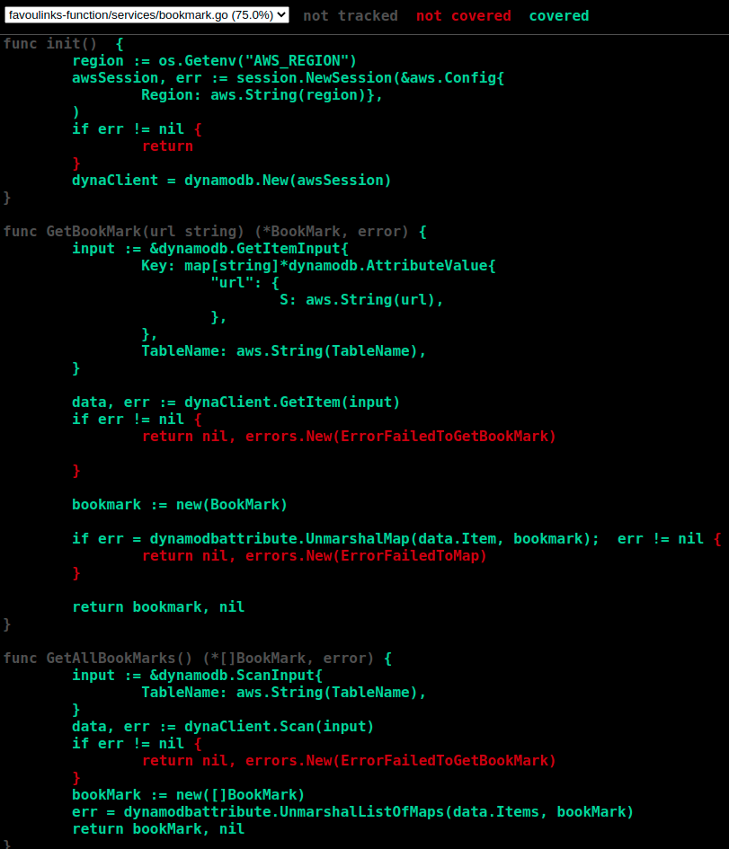

# Favoulinks
Favoulinks is an application where a user can store their favourites bookmarks for easy access in the future. Each bookmark should have a title, clickable URL and an optional category. Using Favoulinks users can create a new bookmark, read bookmarks created, update exists bookmarks and delete bookmarks stored.

# Technologies
This is the Favoulinks server-side repository. The backend was build in AWS Lambda using Golang, Amazon DynamoDB, Amazon API Gateway and The AWS Serverless Application Model (SAM) to define the application and model it using YAML.

# Installation
   * [Create an AWS account](https://aws.amazon.com/)
   * [Configure AWS credentials](https://docs.aws.amazon.com/cli/latest/userguide/cli-configure-quickstart.html)
   * [Install the AWS SAM CLI](https://docs.aws.amazon.com/serverless-application-model/latest/developerguide/serverless-sam-cli-install.html)

# Usage
1. Build `template.yaml` to compile any dependencies that you have in the application and moves all the files into the `.aws-sam/build` folder :
```bash
    sam build
```
2. Package and deploy the application using the default arguments :
```bash 
    sam deploy --guided
```
3. Once deploy finish the output will show on the console :
```bash 
Key                 FavoulinksApi
Description         Favoulinks API Gateway endpoint URL for Prod stage
Value               https://x8to3u904e.execute-api.us-east-2.amazonaws.com/Prod/favoulinks/
```
   * Use the URL on `Value` to access the endpoint
# Endpoints
* GET :

    * 
    ```bash 
        curl --location --request GET 'https://uri-example.amazonaws.com/Prod/favoulinks/'
     ```
    * 
    ```bash 
        curl --location --request GET 'https://uri-example.amazonaws.com/Prod/favoulinks/?url=bbc.co.uk'
     ```
* POST :
```bash 
    curl --location --request POST 'https://uri-example.amazonaws.com/Prod/favoulinks/' \
            --header 'Content-Type: application/json' \
            --data-raw '{
                "title": "BBC",
                "url": "bbc.co.uk",
                "category": "News"
            }'
```
* PUT : 
```bash 
    curl --location --request PUT 'https://uri-example.amazonaws.com/Prod/favoulinks/' \
     --header 'Content-Type: application/json' \
     --data-raw '{
        "title": "BBC",
        "url": "bbc.co.uk",
        "category": "Everything"
     }'
```
* DELETE :
```bash 
    curl --location --request DELETE 'https://uri-example.amazonaws.com/Prod/favoulinks/?url=bbc.co.uk'
```

#Tests
This project has some unit tests on the service layer to make sure the business rules were right implemented. To run these tests, please perform the following instructions on the service layer directory:
```bash
    AWS_REGION=us-east-2 go test -coverprofile=coverage.out && go tool cover -html=coverage.out
```
As you can see these instructions has an environment variable `AWS_REGION=us-east-2` linked to the AWS region, which is required. Then we have the go command `go test -coverprofile=coverage.out` to find and perform the tests and another command `go tool cover -html=coverage.out` to apply a coverage tool and see tests coverage.

The first instruction will display the percentage of tests cover.
```bash
    PASS
    coverage: 75.0% of statements
    ok  	favoulinks-function/services	10.359s
```

The second instruction is going to open on the browser a report presenting the source code and its coverage.




